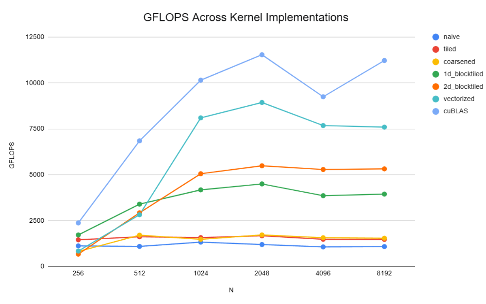
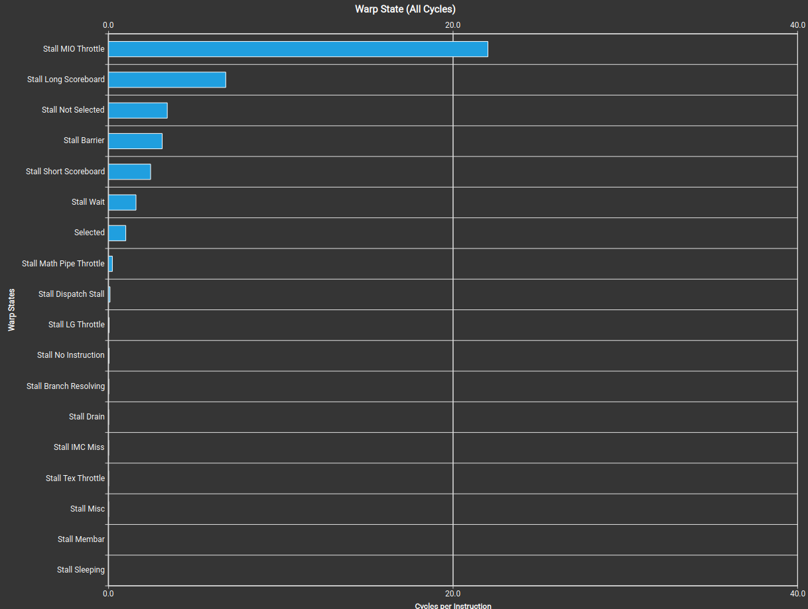
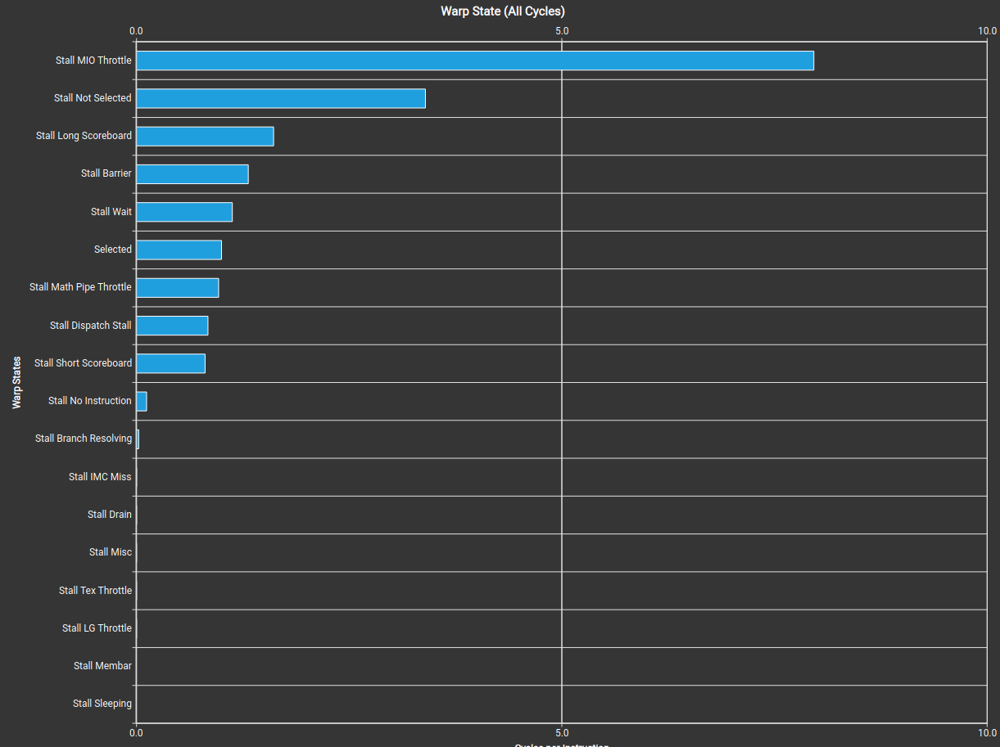
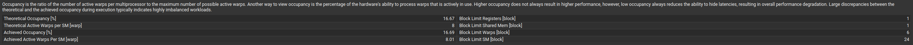
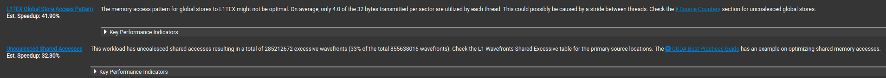

# CUDA SGEMM

Progressive optimization of single-precision matrix multiplication in CUDA. Achieves up to 83.1% of cuBLAS SGEMM performance on RTX 4070 Laptop GPU through 6 GPU kernel implementations.

## Motivation

Matrix multiplication is the foundation of most modern ML workloads and an effective benchmark for GPU optimization. I chose it as a means of learning how to write high-performance CUDA kernels, working through a progression from a naive CPU implementation to a GPU kernel competitive with cuBLAS by implementing each optimization stage myself.

## Hardware and Environment

- **GPU:** NVIDIA GeForce RTX 4070 Laptop GPU (Ada Lovelace, sm_89, 36 SMs, 32 MiB L2 cache)
- **OS:** WSL2 Ubuntu on Windows 11
- **CUDA Toolkit:** 13.3
- **Compile flags:** `-arch=sm_89 -lcublas`

## Baselines

- **Baseline 1-3:** CPU implementations (naive, loop-unrolled, cache-blocked). Established the matmul algorithm in C++ before introducing GPU parallelism.
- **Baseline 4:** Naive GPU kernel. One thread per output element with coalesced memory access.
- **Baseline 5:** Tiled shared-memory kernel with optional thread coarsening.
- **Baseline 6:** 1D block tiling. Each thread computes 8 output elements as a column.
- **Baseline 7:** 2D block tiling. Each thread computes an 8×8 tile with register-resident A and B values.
- **Baseline 8:** Vectorized memory access via float4, with transposed A layout in shared memory. **[Final: 83% of cuBLAS at N=4096]**

## Build

`nvcc -arch=sm_89 -lcublas -o benchmark benchmark.cu`

(and similar for other .cu files)

## Reproducing Results

`./benchmark`
Outputs results.csv with GFLOPS and timings across N ∈ {256, 512, 1024, 2048, 4096, 8192}.

## Analysis

### Progression Summary

This section goes through my progression from a naive GPU baseline to the final vectorized kernel, covering the reasoning behind each optimization and the ncu profiling data that guided later choices. Peak performance climbs from ~12% of cuBLAS at baseline 4 to 83% at baseline 8 (N=4096), spanning a roughly 7x GFLOPS improvement. The chart below shows the full progression across square matrix sizes.

*GFLOPS across all baselines and cuBLAS from N=256 to N=8192.*

### Kernel-by-Kernel Findings

**Baseline 4 (Naive GPU):** 
Each thread maps to one output element of C and computes its dot product by directly reading rows of A and columns of B from global memory. At N=4096, it produces ~1100 GFLOPS (12% of cuBLAS) on my system. I unknowingly implemented coalesced memory access from the start, which is where consecutive threads read consecutive addresses, allowing the GPU to merge 32 accesses per warp into single transfers. This yielded roughly a 4x speedup over the same algorithm without coalescing.

**Baseline 5 (Tiled + Coarsened):** 
The naive kernel loads each element of A and B from global memory for every output element that needs it. Tiling reduces global memory traffic by loading blocks of A and B into shared memory (fast on-chip SRAM  with ~10x lower latency than global memory) so threads in a block can reuse the loaded data. My tiled kernel reached 1485 GFLOPS at N=4096 (16% of cuBLAS). The reason for the small improvement over baseline4 is modern GPU caching technologies already reduce redundant global memory accesses. Thread coarsening extends tiling by having each thread compute multiple output elements across the block dimension, which reduces redundant global memory loads across blocks because the same slice of A no longer needs to be loaded independently by each block computing outputs in that row-strip. In my measurements, this yielded only ~4% improvement over standard tiling because of the previously mentioned caching technology targeting this already.

**Baseline 6 (1D Block Tiling):** 
Baseline 6 keeps the same shared memory tiling from baseline 5. Baseline 5's warp state statistics showed stall MIO throttle as the dominant warp stall (~20 cycles per instruction), indicating shared memory access was the primary bottleneck. To combat this, each thread now caches an element of B into a register per inner-loop iteration and computes 8 output elements that form a column instead of one. This cuts shared memory traffic to Btile by 8x, allowing the kernel to hit 3859 GFLOPS at N=4096 (41.7% of cuBLAS), a 2.5x jump over baseline 5. Stall MIO throttle dropped to ~8 cycles per instruction, a 2.5x reduction matching the throughput gain.

*Baseline 5: Stall MIO Throttle dominates (~20 cycles/instruction)*

*Baseline 6 after 1D block tiling: MIO Throttle reduced to ~8 cycles/instruction (note: x-axis scales differ between charts)*

**Baseline 7 (2D Block Tiling):** 
The main change from baseline 6 is that each thread now computes an 8x8 square rather than an 8-element column of C. As such, it also caches an element of A to go with the element of B per inner loop iteration, further reducing shared memory traffic and increasing arithmetic intensity. The kernel achieves 5284 GFLOPS at N=4096 (57.2% of cuBLAS). Ncu profiling showed that occupancy was severely limited by the 138 registers being used and the amount of shared memory being allocated. Lower occupancy limits the warp scheduler's ability to hide long-latency operations, like loads, by switching to ready warps. This motivated the vectorized memory access work in baseline 8.

*Baseline 7 ncu occupancy analysis: register pressure limits the number of blocks/SM to 1, capping occupancy to 16.7%*

**Baseline 8 (Vectorized Memory Access):** 
Ncu's memory workload analysis on baseline 7 flagged two related issues: only 4 of 32 bytes per sector were being utilized in global stores, estimating a 42% speedup opportunity, and uncoalesced shared memory accesses, estimated at 32%. Both point towards memory access granularity being a bottleneck to target. Baseline 8 addresses this via float4 vectorization, which allows 4 contiguous floats to move together in one memory instruction, and by transposing A during the load into shared memory. Atile needs to be transposed because the inner loop reads down columns of Atile, which aren't contiguous in the original layout, but contiguous after transposition. The kernel achieves 7677 GFLOPS at N=4096 (83.1% cuBLAS), a 1.45x improvement over baseline 7. Ncu confirms the shift, with the registers per thread dropping to 106, the compute SoL rising from 41% to 55%, and memory SoL rising from 48% to 69%. Strategies such as asynchronous global memory copies, double buffering, and warp specialization would be natural next steps if extending this project further.

*Baseline 7 ncu memory workload analysis: uncoalesced global stores (41.9% est. speedup) and uncoalesced shared accesses (32.3% est. speedup) motivated the vectorization in baseline 8.*

### The N=4096 Falloff Pattern

Baselines 6-8 and cuBLAS all demonstrated a dip in GFLOPS from N=2048 to N=4096 as is visible on the graph. At N=2048, matrices A and B together occupy 32 MiB (2 × 2048² × 4 bytes), which fits into my RTX 4070 Mobile's L2 cache of 32 MiB. When the matrix size goes up, data needs to get fetched from global memory rather than the on-chip cache, contributing to the dip in performance. At N=8192, cuBLAS is able to recover, reflecting its use of more sophisticated memory pipelining techniques that hide DRAM latency in ways my baselines do not, which is why the cuBLAS-relative performance of baseline 8 goes from 83% at N=4096 to 68% at N=8192.

### Comparison to Simon Boehm's SGEMM Series

Baselines 6-8 follow the optimization progression documented in Simon Boehm's SGEMM series (https://siboehm.com/articles/22/CUDA-MMM), which served as my primary reference for the aforementioned kernels. The table below compares my results against his at equivalent optimization stages. Note that absolute GFLOPS aren't comparable since he benchmarked on an A6000 with significantly more DRAM bandwidth, but the cuBLAS-relative performance on each respective hardware is a fair comparison.
| Boehm's Kernel | Boehm's % of cuBLAS | My Comparable Baseline | My % of cuBLAS (N=4096) |
|---|---|---|---|
| 1: Naive (uncoalesced) | 1.3% | N/A — my naive was already coalesced | — |
| 2: GMEM Coalescing | 8.5% | Baseline 4 | 11.6% |
| 3: SMEM Caching | 12.8% | Baseline 5 (tiling only) | 16.1% |
| 4: 1D Blocktiling | 36.5% | Baseline 6 | 41.7% |
| 5: 2D Blocktiling | 68.7% | Baseline 7 | 57.2% |
| 6: Vectorized Mem Access | 78.4% | Baseline 8 | 83.1% |

My baseline 7 (2D Blocktiling) underperforms Boehm's equivalent by ~11 percentage points. My baseline 8 (Vectorized Mem Access) matches or slightly exceeds his ratio. The 2D tiling gap likely reflects that different hardware profiles favor different tile constants. My final baseline 7 uses BM=BN=128 with 256 threads/block, tuned via ncu; Boehm may use different constants better suited to A6000's register file characteristics. As mentioned, the performance of baseline 7 was severely limited by occupancy, which may not have been an issue for him, but I can't be certain without his profiling data.

## Known Limitations

- Tile constants are hard coded as compile time constants, meaning kernels need retuning for other devices
- Baseline 8 doesn't support arbitrary matrix dimensions due to float4 vectorization requiring k and l to be divisible by 4
- Only tested on RTX 4070 Laptop GPU (Ada Lovelace, sm_89)
- Early benchmark harness contained verification bugs that produced overstated performance numbers current harness verifies each kernel against cuBLAS before timing
- More optimization possible via strategies discussed in baseline 8 section like double buffering etc.
- CPU baselines 1-3 included but not benchmarked against GPU kernels, as comparison against compute types wasn't the point of this project
- Tests done without compiler optimization to be representative of algorithmic changes, so might not portray real-world use